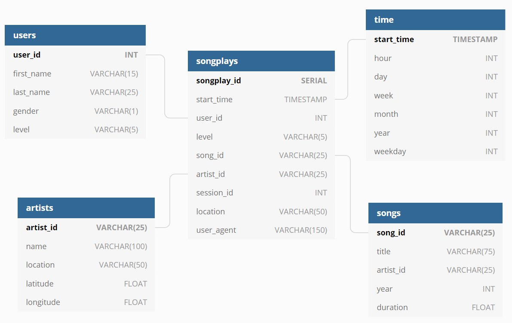

# Data Modelling with Postgres 
### Udacity Data Engineering Project

# Quickstart
1. Update the 'setup.cfg' file to include database credentials
2. Run the 'create_tables.py' file
3. Run the 'etl.py' file

## Background

In this project, a ficticous company, Sparkify, requested to create a structued way to query the data collected at the company. The data collected is:
- Song data
- User activity

This data is stored in JSON files and can be located in the 'data' folder. 

## Project Goal

The main goal of the analytics team is to be able to analyze what songs users are listening to.

## Suggested Database Design

It was decided that a star schema built around the user activity, would be best suited.

### Fact Table
- songplays (user activity)

### Dimension Tables
- users (what are the demographics of it's users)
- songs (what songs where being listened to)
- artists (what artists where most or least popular)
- time (determine what trends were relating to when their service was being used)

This strucuture would allow better understanding not only of the songs most listened to, but also who their users where, what artists were in demand and how often users are interacting with their service.
